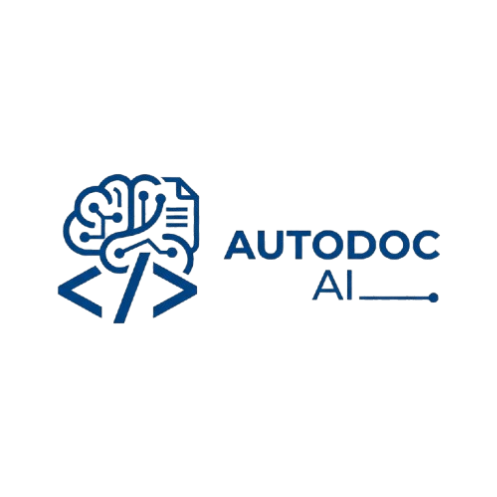
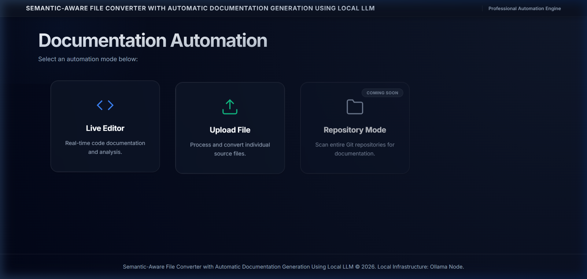
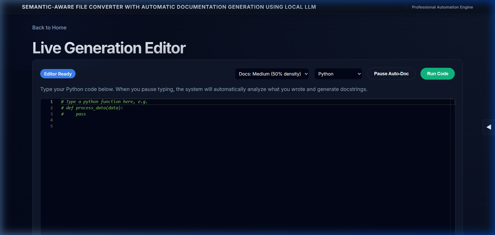
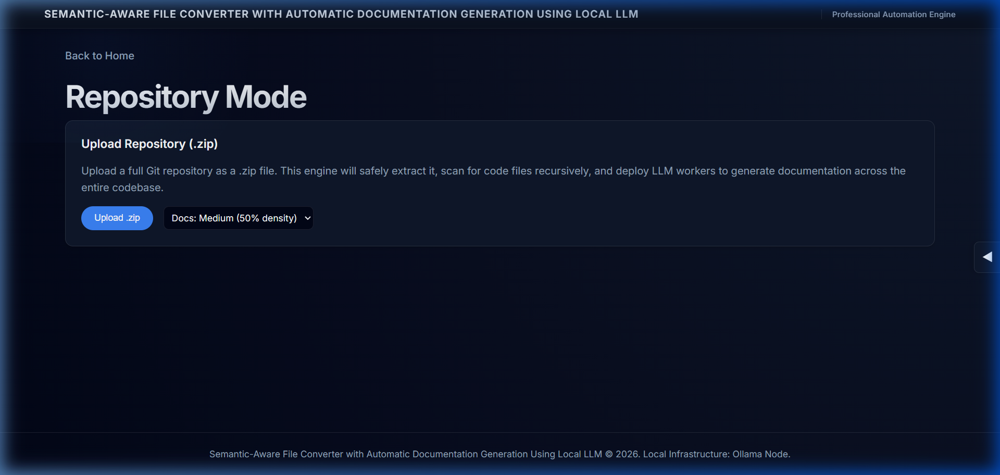

<a id="readme-top"></a>

<div align="center">



<h1>AutoDoc AI</h1>
<p><strong>Semantic-Aware File Converter & Automatic Documentation Engine</strong></p>

[](https://python.org)
[](https://fastapi.tiangolo.com)
[](https://ollama.com)
[](https://unlicense.org)

</div>

---

## 

AutoDoc AI is designed to revolutionize the way developers maintain and present their codebases by automating the most tedious parts of software development: documentation and reporting.

### Objective 1 — Automate Docstring Generation
Leverage local Large Language Models (LLMs) to analyze code context and automatically generate high-quality Python docstrings. The system uses background RPA (Ghost Typing) to insert documentation directly into the active editor or in-place via the web interface.

### Objective 2 — Transform Repositories Semantically
Enable high-volume project documentation by processing entire `.zip` repositories. The engine recursively scans deep directory structures, applies semantic analysis to every module, and produces a fully "documented" version of the codebase while preserving the original logic.

### Objective 3 — Professional Automated Reporting
Convert raw source code, Markdown files, or Jupyter Notebooks (`.ipynb`) into professional PDF and DOCX reports. These reports feature automated **AI Summaries** that describe complexity, project scope, and learning paths, making them ideal for academic submissions or project handovers.

---

## 

```
AutoDoc AI Suite
│
├── Backend (app/)                 ← FastAPI core and background services
│   ├── api/                       ← REST API endpoints for all tools
│   ├── services/                  ← LLM, RPA, Parser, and Git processing logic
│   ├── pdf_converter/             ← Native report generation (PDF/DOCX)
│   └── templates/                 ← Jinja2-powered dynamic frontend engine
│
├── Frontend (static/)             ← Advanced CSS/JS client interface
│   └── components/                ← Modular UI cards, bars, and layouts
│
└── Conversion Pipeline            ← Native Markdown to Document flow
```

### Data Flow

```
Raw Code / .zip Repo
    │
    ▼
[Parser Service]  ──extract──▶  Functions, Classes, & Metadata
    │
    ▼
[LLM Heuristic Engine]  ──analyze──▶  Semantic Context (llama3.2)
    │
    ▼
[DocGen / RPA Service]  ──insert──▶  Documented Code
    │
    ▼
[Document Converter]  ──render──▶  Professional PDF / DOCX
```

---

## 

### Core Backend & AI

| Layer | Technology | Purpose |
|---|---|---|
| Language | Python 3.10+ | Primary application runtime |
| Web Framework | `FastAPI` | High-performance asynchronous API |
| LLM Provider | `Ollama` | Local hosting of llama3.2 inference model |
| RPA Engine | `PyAutoGUI` | Automated "Ghost Typing" of docstrings |
| PDF Generation | `ReportLab` | Native high-fidelity PDF rendering |
| DOCX Generation | `python-docx` | Native Microsoft Word document assembly |

### Web Interface & Templating

| Layer | Technology | Purpose |
|---|---|---|
| Templating | Jinja2 | Dynamic HTML generation and partials |
| Styling | Vanilla CSS | Custom modern dark-themed aesthetics |
| Interaction | JavaScript | Real-time websocket-style updates and UI logic |
| Static Files | StaticFiles | Managed delivery of CSS/JS/Image assets |

---

## 

```
combine_auto_doc/
│
├── 📂 app/
│   ├── 📂 api/                # FastAPI routers and endpoints
│   ├── 📂 core/               # App configuration and global settings
│   ├── 📂 pdf_converter/      # PDF/DOCX conversion logic & templates
│   ├── 📂 services/           # LLM, Git, Parser, and RPA services
│   ├── 📂 static/             # CSS components and client-side assets
│   ├── 📂 templates/          # Jinja2 HTML templates for all modes
│   └── main.py                # Main application entry point
│
├── 📂 client/
│   └── listener.py            # Local agent for RPA hotkey listening
│
├── 📂 images/                 # Product screenshots and brand assets
│
├── 📂 merged_app/             # Consolidated logic for standalone deployment
│
├── 📂 project documents/      # External documentation and project briefs
│
├── 📂 temp_repos/             # Working directory for ZIP repo processing
│
├── 📂 tests/                  # Unit and integration testing suites
│
├── requirements.txt           # Python dependency manifest
└── README.md                  # This file
```

---

## 

### Prerequisites

```bash
# Python 3.10 or higher required
python --version

# Ollama required (running llama3.2)
ollama run llama3.2
```

### 1. Setup Environment

```bash
# Clone the repository
git clone https://github.com/Shashwath-K/Python_auto_documenter.git
cd combine_auto_doc

# Install dependencies
pip install -r requirements.txt
```

### 2. Launch the Application

```bash
# Start the FastAPI server
uvicorn app.main:app --reload
```

The application will be accessible at `http://127.0.0.1:8000`.

### 3. Run the Client Listener (Optional for RPA)

```bash
# Start the background hotkey listener
python client/listener.py
```

---

## 

### 1. Project Dashboard
The central hub for all documentation modes featuring a professional dark UI.


### 2. Live Generation Editor
Real-time code analysis with semantic-aware docstring insertion.


### 3. Repository Documentation
Scan, process, and download entire projects with automated documentation.


---

## 

- [x] **v1.0**: Live Editor and individual file upload.
- [x] **v1.1**: Repository Mode (.zip support) and Native PDF/DOCX.
- [x] **v1.2**: AI-Generated Summary Reports (Complexity & Insights).
- [ ] **v2.0**: Direct VS Code Extension integration.
- [ ] **v2.1**: Support for multi-language LLM analysis (Go, Rust, etc.).

---

## 

### Step 1 — Semantic Parsing
`services/parser_service.py` uses Abstract Syntax Trees (AST) to identify functions, classes, and method signatures that lack documentation.

### Step 2 — LLM Generation
The parsed code chunks are sent to the `llm_service.py`, which prompts the local Ollama instance. It generates docstrings that match the code's logic, parameters, and return types.

### Step 3 — RPA Ghost Typing
For real-time insertion, `services/rpa_service.py` uses keyboard automation to "type" the generated docstrings directly into your source file without manual copy-pasting.

### Step 4 — Document Assembly
`pdf_converter/` modules take the documented markdown or notebooks and render them into professional reports using distinct theme templates (Classic, Modern, etc.).

---

## 

Distributed under the Unlicense License. See `LICENSE.txt` for more information.

<p align="right">(<a href="#readme-top">back to top</a>)</p>
